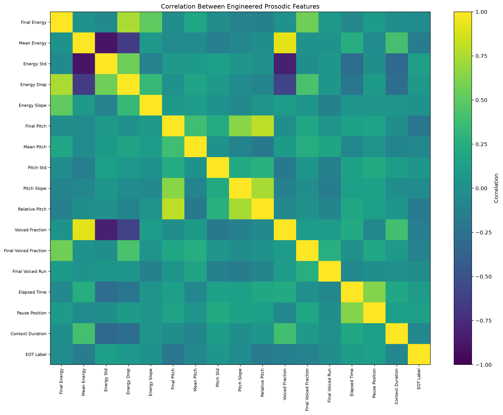
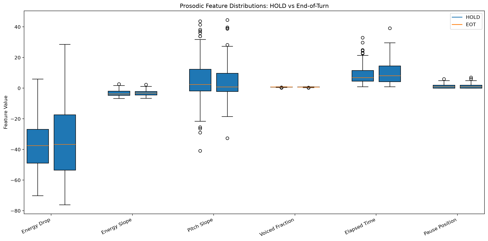
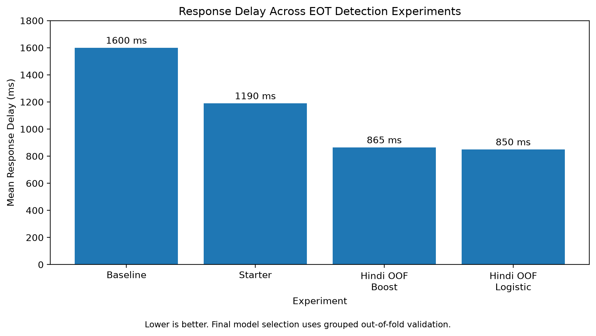
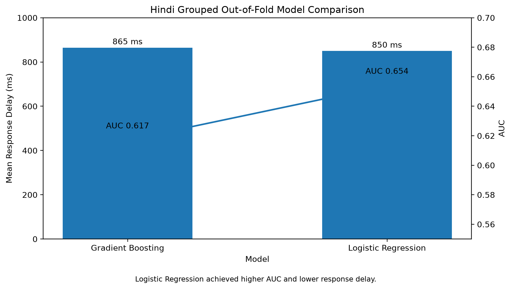

# End-of-Turn Detection

This repository contains my experiments for the End-of-Turn (EOT) detection task.

The problem sounded fairly simple when I first read it: given a pause in someone's speech, predict whether the person has actually finished speaking or is just taking a temporary pause.

Once I started working on it, though, I realised that this is a surprisingly interesting problem.

A conversational system cannot simply wait forever to make sure someone has finished speaking. Respond too early and you interrupt the user. Wait too long and the conversation feels slow and unnatural.

There is another constraint that makes the problem harder: the prediction has to be **causal**. At a candidate pause, the model can only use information that occurred before the pause. It cannot look at what the speaker does afterwards.

So I approached this mainly as an experimentation problem. I started with the provided baseline, looked at what information might exist in the audio before a pause, engineered a few prosodic features, tried different models, and gradually changed the validation setup as I understood the problem better.

This repository is basically the trail of that exploration.

---

## What I started with

The starter model used a very small number of features:

- energy immediately before the pause
- final pitch
- amount of available speech context

It was useful as a sanity check, but the performance also made it clear that a few instantaneous measurements were probably not enough.

My intuition was that **how the voice approaches a pause** might contain more information than simply measuring the final frame.

For example:

- Does the speaker's energy gradually fall before stopping?
- Is the pitch falling, rising, or staying flat?
- How stable is the pitch near the end?
- How much of the recent audio is actually voiced?
- Is this the first pause in the turn or has the speaker already paused several times?
- Does a pause occurring later in a long turn behave differently from one occurring near the beginning?

These questions led to most of the feature engineering that followed.

---

## Exploratory Data Analysis

Before deciding on the final model, I wanted to look at how some of these features actually behaved in the data.

The plots below use features extracted from the Hindi development data. Importantly, all audio-derived features are calculated using only audio available **before** `pause_start`.

### Feature Correlations

I generated a correlation heatmap across the engineered features and the EOT label.

One thing I wanted to check here was whether I had simply created multiple versions of essentially the same signal. Some of the energy and pitch statistics are naturally related, while the turn-context features capture something quite different.

This was useful because it made me think of the feature set less as "16 independent features" and more as a few families of signals:

- energy behaviour
- pitch behaviour
- voicing behaviour
- turn context

I found that no single feature appeared to provide an obvious solution to the problem, which made combining multiple signals more interesting.

### EOT vs HOLD

I also compared selected feature distributions for actual end-of-turn pauses (EOT) and temporary pauses (HOLD).

I was particularly interested in:

- energy drop
- energy slope
- pitch slope
- voiced fraction
- elapsed time
- pause position

The interesting part here was actually the overlap.

There was no clean boundary where one feature could simply separate EOT from HOLD. That ruled out the idea of relying on a simple rule such as:

> "If energy drops below some threshold, the speaker must be finished."

Real speech is obviously messier than that.

This pushed me towards using a classifier that could combine several weak signals rather than trying to find one perfect acoustic indicator.

---

## Feature Engineering

After the initial experiments, I expanded the feature vector to 16 causal features.

### Energy

I used:

- final energy
- mean recent energy
- energy standard deviation
- energy drop relative to recent context
- energy slope approaching the pause

The idea behind the slope was to capture the *trajectory* of the speaker's energy rather than only its final value.

### Pitch (F0)

For pitch, I explored:

- final pitch
- mean pitch
- pitch standard deviation
- recent pitch slope
- final pitch relative to the recent mean

I was curious whether falling pitch would be more common near completed statements while rising or stable pitch might indicate continuation.

This is obviously not a universal linguistic rule, especially across languages, but it seemed worth testing as one signal among several.

### Voicing

I also added:

- fraction of voiced frames
- final voiced fraction
- length of the final voiced run

These features try to describe how speech activity behaves immediately before the pause.

### Turn Context

Finally, I included:

- elapsed time in the turn
- pause index / position
- available context duration

These are not acoustic features, but I thought they might still matter.

A pause occurring very early in a turn may have a different prior probability of being an EOT compared with a pause after a longer stretch of speech.

Again, all of these features are causal. Nothing after the candidate pause is used.

---

## Experiments

I tried several versions rather than committing to one model immediately.

The early experiments were useful for understanding the metric and testing feature ideas, although not every number in this progression comes from exactly the same validation setup.

That became an important lesson during the project.

At one point, I realised that training a model on all the provided data and then scoring predictions on those same examples could make the results look much better than they actually were.

So I changed the evaluation strategy.

---

## Grouped Out-of-Fold Validation

The data contains multiple candidate pauses belonging to the same turn.

Randomly splitting individual pauses could therefore leak information between training and validation. Pauses from the same turn might appear on both sides of the split.

To avoid this, I switched to grouped validation where complete turns are kept together.

I then used 5-fold out-of-fold (OOF) predictions so that every prediction used for evaluation came from a model that had not trained on that turn.

This gave me a more realistic picture of generalisation.

The OOF results were:

| Language | Model | AUC | Mean Response Delay | Interrupted Turns |
|---|---|---:|---:|---:|
| Hindi | Gradient Boosting | 0.617 | 865 ms | 5.0% |
| Hindi | Logistic Regression | 0.654 | 850 ms | 5.0% |
| English | Logistic Regression | 0.596 | 1301 ms | 5.0% |

The Hindi comparison was particularly interesting.

I initially expected the nonlinear Gradient Boosting model to perform better because it could capture interactions between features.

That did not happen.

The simpler Logistic Regression model produced both a higher OOF AUC and a slightly lower response delay on Hindi.

I also experimented with combining Logistic Regression and Gradient Boosting predictions. The ensemble did not improve the main response-delay metric, so I did not use it simply for the sake of having a more complicated final model.

---

## The Metric Changed How I Thought About the Problem

One of my main takeaways from this task was that **classification accuracy is not really the final objective**.

The system needs to respond quickly, but it also needs to keep interrupted turns below 5%.

That creates a very different optimisation problem.

A classifier can have decent accuracy or AUC and still be a bad conversational turn detector if it responds too aggressively and constantly interrupts people.

On the other hand, a model could avoid almost every interruption simply by waiting for a very long time, but that would make the assistant painfully slow.

So the interesting part is finding an operating point between the two.

During experimentation, I therefore tracked:

- AUC
- held-out / OOF behaviour
- mean response delay
- interrupted-turn percentage
- decision threshold

This was much more informative than looking at accuracy alone.

---

## Hindi vs English

Another thing I noticed was that the same setup did not behave equally well on Hindi and English.

The difference in OOF performance made me question whether forcing both languages through exactly the same trained classifier was necessarily the best choice.

Prosody can vary across languages, and even if the same feature definitions are useful, their learned weights may not need to be identical.

So I experimented with language-specific specialist models.

The final training pipeline produces:

- a Hindi specialist model
- an English specialist model
- a global fallback model

During inference, the script determines the language from the available dataset identifiers / structure and loads the corresponding specialist. If the language cannot be determined, it uses the global model.

I would like to explore this idea more with a larger multilingual dataset, because the current dataset is too small to make strong claims about language-specific prosody. For this task, I treated it mainly as an empirical modelling choice based on the validation behaviour I observed.

---

## Final Approach

The final system uses Logistic Regression models trained on the engineered causal features.

I ended up preferring this over the more complex model because:

1. it performed better in my grouped OOF comparison,
2. the dataset is relatively small,
3. the features themselves already encode useful nonlinear-ish concepts such as slopes and relative changes,
4. and the model remains easy to inspect and debug.

The final inference pipeline loads a previously trained model and predicts EOT probabilities on unseen data.

`predict.py` does **not** refit the classifier on evaluation data.

That distinction became important during experimentation, so I made sure the final inference path uses saved model artifacts.

---

## Repository Structure

- `predict.py` — final inference pipeline
- `train.py` — trains the Hindi, English and global models
- `features.py` — audio loading and feature utilities
- `hindi_model.joblib` — saved Hindi specialist model
- `english_model.joblib` — saved English specialist model
- `global_model.joblib` — saved fallback model
- `train_oof.py` — grouped out-of-fold experiments
- `train_experiment1.py` — earlier feature experiment
- `baseline.py` — baseline implementation
- `score.py` — evaluation utility
- `RUNLOG.md` — record of experiments and scores
- `NOTES.md` — implementation notes
- `SUMMARY.html` — project summary
- `requirements.txt` — Python dependencies

---

## Running the Model

Install the dependencies:

    pip install -r requirements.txt

Run inference:

    python predict.py --data_dir <path_to_data> --out predictions.csv

The generated CSV has the format:

    turn_id,pause_index,p_eot

where `p_eot` is the predicted probability that the candidate pause represents an end of turn.

---

## What I Would Explore Next

There are still quite a few things I would like to try if I continued working on this.

The first would be proper error analysis by listening to false positives and false negatives. I suspect there are specific types of pauses — hesitation, breath pauses, sentence-internal pauses, trailing speech — where the current features behave differently.

I would also like to explore:

- better modelling of final-syllable lengthening
- speaker-normalised pitch features
- pause-history features across a turn
- calibration specifically around the <=5% interruption operating region
- direct optimisation for the latency/interruption trade-off
- richer learned audio representations, while maintaining strict causality
- more robust multilingual modelling with larger datasets

I would especially want to investigate the English results further. The gap between Hindi and English was one of the more interesting findings from my experiments, but with this amount of data I don't think there is enough evidence to confidently explain *why* the gap exists.

---

## Final Thoughts

What I liked about this problem is that my first instinct — "just classify whether the pause is an EOT" — turned out to be an incomplete way of thinking about it.

The actual problem is closer to:

**How early can I become confident that someone has finished speaking without becoming an annoying system that interrupts them?**

That made the task much more interesting.

I tried simple features, added richer prosodic context, tested a nonlinear model, tried ensembling, experimented with pause-position adjustments, changed the validation strategy when I realised the earlier evaluation was optimistic, and eventually ended up returning to a relatively simple Logistic Regression model.

Some experiments improved the result. Some did basically nothing.

But those failed experiments were still useful because they narrowed down what actually mattered.

The final model is not the most complicated model I tried. It is simply the one that made the most sense based on the experiments I was able to run and validate.

I explored multiple versions of the feature set, Logistic Regression, Gradient Boosting, model ensembling, pause-position adjustments, and different validation strategies. The final solution is deliberately relatively simple, but it is the result of comparing these alternatives rather than choosing the first model that worked.
